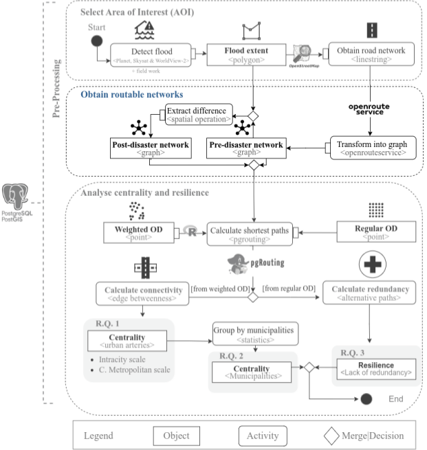

# Analysis Centrality and Resilience

This section describes the lane of the workflow that **analyse centrality and resilience**. 

* We **transform into graph** the road network from OSM using openrouteservice, which finally led to create the pre-disaster network. 
* The flood extent is used to  **extract the difference** with the pre-disaster network obtaining the post-disaster network graph. 

The pre-processing phase is finished providing the main objects of the study, the flood extent, municipalities, road network and hospitals. We used these objects in the centrality and accessibility study.
## Regular OD

## Weighted OD

## Regular OD

## Calculate connectivity

## Calculate redundancy

Work in progress, waiting for acceptance.
