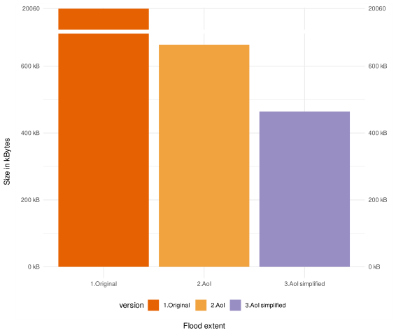

# Detect flood

The downloaded flood extent covered a larger area in Rio Grande do Sul.
However, the area of interest containing the urban dense cities such as Porto Alegre was smaller.
Therefore, a series of operations reduced the large area focusing on Porto Alegre, while improving the query performance.

```{r}
#| eval: true
#| echo: false
#| include: false
1+1
```


Firstly, we subdivided the extent of the flooding following the post published by the co-founder of PostGIS ^[[https://blog.cleverelephant.ca/2019/11/subdivide.html](https://blog.cleverelephant.ca/2019/11/subdivide.html)], Paul Ramsay.
The reason for also removing the slivers polygons was that operations such as st difference, which are required to obtain the post-disaster network, are computationally expensive.
Therefore, we followed Carto’s post to remove
them based on the calculated area ^[[https://icarto.es/en/improve-performance-making-the-difference-between-two-layers-with-postgis/](https://icarto.es/en/improve-performance-making-the-difference-between-two-layers-with-postgis/)].
Another well-known technique in PostGIS to remove
these slivers polygons is via dilation and erosion ^[[https://trac.osgeo.org/postgis/wiki/UsersWikiBufferCoast](https://trac.osgeo.org/postgis/wiki/UsersWikiBufferCoast)] ^[[https://cdn2.hubspot.net/hubfs/2283855/PostGIS%20Day%202019%20-%20Overview.pdf](https://cdn2.hubspot.net/hubfs/2283855/PostGIS%20Day%202019%20-%20Overview.pdf)].

```{sql}
#| eval: false
#| echo: true
#| code-summary: "Detect flood extent"

CREATE TABLE flooding_subdivided_porto AS
 WITH porto_alegre_ghs AS(
    SELECT
      ghs.*
    FROM
      urban_center_4326 AS ghs
    JOIN
      nuts
    ON
      st_intersects(nuts.wkb_geometry, ghs.geom)
  WHERE
    nuts.shapename = 'Porto Alegre'),
--- Select core metropolitan areas in the municipalities that intersects with ghs
core_metropolitan_area_ghs AS (
	SELECT 
		st_union(wkb_geometry) AS core_geom
	FROM 
		nuts
	JOIN 
		porto_alegre_ghs
	ON 
		st_intersects(nuts.wkb_geometry,
					  porto_alegre_ghs.geom)),
---Subdivide the flood extent to increase spatial indexes performance
flooding_sul_subdivided AS (
    SELECT
      st_subdivide(geom) as the_geom
    FROM
      flooding_raw)
/* Select the flooding subunits that intersects with
the previous bounding box */
    SELECT
      flooding_sul_subdivided.*
    FROM
      flooding_sul_subdivided,
      core_metropolitan_area_ghs
    WHERE
      st_intersects(flooding_sul_subdivided.the_geom,
                    core_metropolitan_area_ghs.core_geom);

```

```{=html}
<iframe width="780" height="500" src="data/media/detect_flood.html" title="Flood extent of the AoI"></iframe>
```


```{r}
#| eval: false
#| echo: true
#| code-summary: Visualization of flood extent

library(sf)
library(DBI)
# Load the flood extent and remove Z dimension
flooding_subdivided_porto <- st_zm(sf::st_read(connection,
                                        DBI::Id(schema="agile_gis_2025_rs",
                                            table="flooding_subdivided_porto")))
core_metropolitan_area <- st_zm(sf::st_read(connection,
                                        DBI::Id(schema="agile_gis_2025_rs",
                                            table="core_metropolitan_area")))
# Create leaflet product
library(leaflet.extras)
library(leaflet)
leaflet() |>
  addTiles()  |>
  addProviderTiles("OpenStreetMap", group = "OpenStreetMap")  |>
  addProviderTiles("Esri.WorldImagery", group = "Esri.WorldImagery")  |>                    addPolygons(data=flooding_subdivided_porto,
                    fillColor = "#dec8b7ff",
                    fillOpacity = 0.6,
                    weight = 1,
                    color = "#4b2609",
                    dashArray = "1",
                    group= "Flood extent") |> 
  addPolygons(data=core_metropolitan_area,
                    fillColor = "yellow",
                    fillOpacity = 0.05,
                    weight = 2,
                    color = "red",
                    dashArray = "1",
                    group= "Core Metropolitan Area") |> 
 addLayersControl(
    baseGroups = c("OpenStreetMap", "Esri.WorldImagery"),
    overlayGroups = c("Flood extent","Core Metropolitan Area"),
    options = layersControlOptions(collapsed = FALSE)
  )
```

We obtained a lighter version of the flood extent using the following code chunk

```{sql}
#| eval: false
#| echo: true
#| code-summary: "Simplifying geometry"

# Reduce geometry
CREATE TABLE flooding_cleaned_porto AS
  SELECT
    ST_Force2D((ST_Dump(the_geom)).geom)::geometry(Polygon, 4326) AS geom
FROM flooding_subdivided_porto;
    
# Unite
CREATE TABLE flooding_cleaned_porto_union AS
  SELECT
    ST_Union(geom)::geometry(multipolygon, 4326) geom
  FROM
    flooding_cleaned_porto;
#
CREATE TABLE flooding_cleaned_porto_union_simple AS
  SELECT
    (ST_Dump(geom)).geom::geometry(polygon, 4326) geom
  FROM
    flooding_cleaned_porto_union;
/*This allowed to calculate the area of each polygon finding
slivers that were removed using the following code.*/
SELECT COUNT(*)
FROM flooding_cleaned_porto_union_simple ; --- count= 99

DELETE FROM
flooding_cleaned_porto_union_simple
WHERE
ST_Area(geom) < 0.0001; ---count= 4.
```

```{=html}
<iframe width="780" height="500" src="/data/media/detect_flood_compare_raw_aoi_raw.html" title"Raw flood extent and its simplication"></iframe>

```


```{r}
#| eval: false
#| echo: true
#| code-summary: "Create map to visualize the flood extent in the AoI and its simplified version"

# Load the flood extent and remove Z dimension
flooding_cleaned_porto_union_simple <- st_zm(sf::st_read(connection,
                                        DBI::Id(schema="agile_gis_2025_rs",
                                            table="flooding_cleaned_porto_union_simple")))
flooding_all <- st_zm(sf::st_read(connection,
                                        DBI::Id(schema="agile_gis_2025_rs",
                                            table="flooding_raw")))
# Visualize the raw flood extent and its simplified version
library(mapview)
library(leafsync)
m1_flood <- mapview(flooding_subdivided_porto, 
              color="#f1a340",
              col.region="#f1a340",
              layer.name ="Raw flooding extent")
m2_flood <- mapview(flooding_cleaned_porto_union_simple,
              color ="#998ec3",
              col.region="#998ec3",
              layer.name="Simplified flooding extent")
m1_flood | m2_flood 
 
```




```{r}
#| eval: false
#| echo: true
#| code-summary: "Create barplot to compare flood extent's versions"

# Compare size of both versions
## Create dataframe
library(tidyverse)
df_flood <- data_frame(
    version = c("raw",
                "raw_aoi",
                "raw_aoi_simplified"),
    size_bytes = c( object.size(flooding_all)/1000,
                    object.size(flooding_subdivided_porto)/1000,
                    object.size(flooding_cleaned_porto_union_simple)/1000)
) 

## Custom Y-axis labels 
labels <- function(x) {
  paste(x, "kB")
}
## Create column plot
library(ggplot2)
library(ggbreak)
flood_plot <- ggplot(data=df_flood) +
  ggplot2::geom_col(aes(x=version, y=size_bytes, fill=version)) +
  labs(x="Flood extent",
       y="Size in kBytes") +
  theme_minimal() +
  theme(legend.position = "bottom") +
  scale_fill_manual(values= c("#e66101",
                              "#f1a340",
                              "#998ec3")) +
  scale_y_break(c(664,20000), ticklabels = c(df_flood$size_bytes[3],
                                             df_flood$size_bytes[2],
                                             round(df_flood$size_bytes[1])))
flood_plot + scale_y_continuous(label = labels)
```

