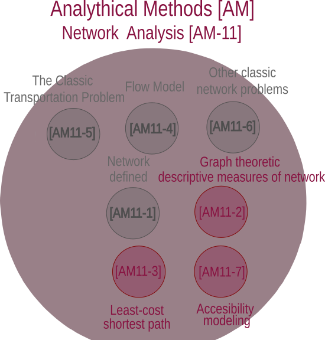

# Welcome {.unnumbered}

The Association of Geographic Information Laboratories in Europe (AGILE) has held annual <span class="font-color">**conferences**</span> focused on Geographic Information Science since 1998. The next [AGILE 2025](https://agile-gi.eu/conference-2025/call-for-papers-2025) conference is held in Dresden, Germany, on 10-13 June 2025. 


The conference <span class="font-color">**theme**</span> _“Geographic Information Science responding to Global Challenges”_ recognizes the pivotal role of geospatial data and analysis in informing decision-making for current global issues affecting humanity, the environment, and global resilience.

In this website you can find in detailed how the full paper presented in AGILE 2025 was carried out in [HeiGIT](https://heigit.org/) mostly in the [Geoinformation for Humanitarian Aid](https://heigit.org/geoinformation-for-humanitarian-aid/) department. The goal is to increase transparency,
reproducibility, and openness of computational GIScience research as stated in the [Reproducible Paper Guidelines](https://osf.io/numa5) from AGILE.


# Body of Knowledge

The <span class="font-color">**topic**</span> of this study includes _Open Spatial Data_, _Open Science_, _Open-source Geospatial Tools and Applications_ , _Disaster and Risk Management_, _Way Finding_, _Routing_ and _Indoor Navigation_ or _Spatial Databases_ and _Data Management_.


The <span class="font-color">**submission type**</span> of this study is _use case_, while the <span class="font-color">**Body of Knowledge**</span> ([BoK](https://bok.eo4geo.eu/GIST)) is the following:

- [[GIST] Geographic Information Science and Technology](https://bok.eo4geo.eu/GIST)
  - [[AM](https://bok.eo4geo.eu/AM)] Analytical Methods. We derive analytical results from such as connectivity or redundancy from public Geospatial data.
    - [[AM11](https://bok.eo4geo.eu/AM11)] Network analysis. We used the road network of the Core Metropolitan area of Porto Alegre to derive results based on the graph theory. In the graph theory edges and nodes are represented as a system of intercon- nected networks (Freeman, 1977; Wasserman and Faust, 1994)
      - [[AM11-2](https://bok.eo4geo.eu/AM11-2)] Graph theoretic descriptive measures of networks. We used edge betweenness indicator to measure the level of connectivity on the road network of Porto Alegre
      - [[AM11-3](https://bok.eo4geo.eu/AM11-3)] Least-cost shortest path. We used pgrouting to compute the optimum path through a network with Dijkstras algorithm based on the weights given by OpenRouteService (ORS).
      - [[AM11-7](https://bok.eo4geo.eu/AM11-7)] Accessibility modeling. We defined a method for measuring redundancy on the access to hospitals.
  - [[[GC4](https://bok.eo4geo.eu/GC4)] Open Science

{width=40%}

## Data description

The table 1 summaries the initial data from which intermediate and final results are derived. The section link includes the origin of the data, so third parties to reuse. In addition, the public [github repository](https://github.com/rruiz-s/agile-gscience-2024-rs-flood) with open data license also provide the data of the study.

The total built-up volume weighted the sampling of the origin and destination and is accessible via the following DOI:[10.2905/AB2F107A-03CD-47A3-85E5-139D8EC63283](https://human-settlement.emergency.copernicus.eu/ghs_buV2023.php). The degree of urbanization determined the urban dense settlement analysed contained the 9 municipalities that comprises the studied area named core metropolitan area and is accessible via the following DOI:[10.2905/A0DF7A6F-49DE-46EA-9BDE-563437A6E2BA](https://doi.org/10.2905/A0DF7A6F-49DE-46EA-9BDE-563437A6E2BA).Similarly, the subset of the flood is derived from the cheias_rhguaiba_2024_db_v11.gpkg accesible in the [DOI:10.5281/zenodo.11164049](https://doi.org/10.5281/zenodo.11164049). We also incorporated data from the Brazilian Institute of Geography and Statistics (IBGR) ^[[https://www.ibge.gov.br/cidades-e-estados/rs/](https://www.ibge.gov.br/cidades-e-estados/rs/)] to add the GPD of the municipalities or from the Economy and Statistics Department of Rio Grande do Sul State(DEE-SPGG) ^[[https://mup.rs.gov.br/](https://mup.rs.gov.br/)] about the population affected by the flood. For the hospitals, we used the dataset   Hospitais_com_Leitos_de_UTIs_no_RS.geojson that included the bed capacity and is accessible via the DOI:[10.7303/syn32211006.1](https://doi.org/10.7303/syn32211006.1). The location of the healthcare facility is obtained using the [WFS](https://iede.rs.gov.br/server/rest/services/SES/Hospitais_Leitos_UTI_RS/FeatureServer) provided by "Secretaria Estadual da Saúde/DGTI".  

## Input data


```{r}
#| echo: true
#| eval: true
#| warning: false
#| code-summary: "How to load csv file and generate table"
library(DT)
library(tidyverse)
input_data_csv <- read.csv("~/agile-gscience-2024-rs-flood/data/source_data/input_data_csv.csv")
input_data_csv$Link <- paste0('<a href="', input_data_csv$Link, '">', 'Link to input: ',"<br />",input_data_csv$Data, '</a>')
input_data_csv |> 
DT::datatable(extensions = 'Buttons',
              filter = "top",
              options=list(
                          dom = 'Bfrtip',
                          columnDefs = list(list(className = 'dt-center', targets = c(1:3))),
                          pageLength = 7,
                           buttons = c('copy', 'csv')),
              escape = FALSE) 
```


# Computational Workflow

## Computation steps

This document is written following the [Reproducibiltiy paper guidelines](https://osf.io/numa5) for the AGILE conference 2025 [@https://doi.org/10.17605/osf.io/cb7z8].The following flowchart explains the methodology to analyse the centrality and resilience of the road network and healthcare facilities in the core metropolitan area of Rio Grande do Sul.

1. <p> <span class= "font-color">**Select Area of Interest (AOI)**</span> includes importing the flood extent, municipalities and the road network affecting the core metropolitan area of Porto Alegre. We name core metropolitan area to the 9 municipalities in the urban dense human settlement that intersects with the municipality of Porto Alegre.</p> 
2. <p> <span class= "font-color">**Obtain routable network**</span> created the two output post-disaster and pre-disaster network. Firstly, OpenRouteService is used to transform the OpenStreetMap data into a routable graph named pre-disaster network. Extracting the difference between the flood extent obtained in the previous lane with the pre-disaster network generated the post-disaster network. Both road networks are graphs, which allow to use the extension pgrotuing.
3.  <p> <span class= "font-color">**Analysis centrality and resilience**</span> is carried out calculating shortest paths with the inputs weighted and regular origin-destination. While calculating connectivity using the edge betweenness indicator provides results to answer the 1st and 2nd research question, calculating the lack of redundancy with alternative paths provides results to answer the third research question.


## Computational environment

* PostgreSQL 15.3 is used from the [docker file container](https://github.com/kartoza/docker-postgis?tab=readme-ov-file) that includes the extension PostGIS 16-3.4-v2024.03.17 and pgrouting 3.5.
* The libraries that includes the study analysis, visualization and creation of this documentation is available with the renv file.
* The study required a CPU Intel(R) Core(TM) i5-4300U CPU @ 1.90 GHz with 15 Gi model HP EliteBook 820 G1. 
* QGIS Version 3.38 ‘Grenoble’ 
* RStudio 2023.06.1+524 "Mountain Hydrangea"
* openrouteservice:v8.0.0 used following the described [docker file container](https://giscience.github.io/openrouteservice/run-instance/running-with-docker) instructions. Specifically, we used the docker settings found in the directory _"~/agile-gscience-2024-rs-flood/data/docker_settings/docker-compose.yml"_ on the project's github.


## Expected execution times


```{r}
#| eval: true
#| echo: true
#| warning: false
#| code-summary: "How to create the table containing the computation times "

library(DT)
library(tidyverse)
computation_agile <- read.csv("~/agile-gscience-2024-rs-flood/data/computation_times_agile_2025 _fresults.csv")
computation_agile_dt <- computation_agile |>
                    mutate( 
                            time_sec = round(time/1000),
                            total_perc=round(time/sum(time)*100,2)) 
DT::datatable(data=computation_agile_dt,
              extensions=c("Buttons",'RowGroup'),
                                 options=list(rowGroup=list(dataSrc= 1),
                                              dom="Bfrtip",
                                              pageLength=11,
                                              buttons=c("copy","csv","pdf","colvis"),
                                              columnDefs =list(list(visible=FALSE, targets=c(1,3)))),
                                  selection="none") |>
  DT::formatStyle("total_perc",
              background=DT::styleColorBar(c(range(computation_agile_dt$total_perc)[1],100),'lightblue'),
                backgroundSize = '98% 88%',
  backgroundRepeat = 'no-repeat',
  backgroundPosition = 'center') 
  
```

# Sponsors

::: {.grid}

::: {.g-col-6}

```{r}
#| echo: false

knitr::include_graphics("~/agile-gscience-2024-rs-flood/data/figures/klaus-logo.png")
```

:::

::: {.g-col-6}

```{r}
#| echo: false

knitr::include_graphics("~/agile-gscience-2024-rs-flood/data/figures/cofounded-erasmus.png")
```

:::

:::


