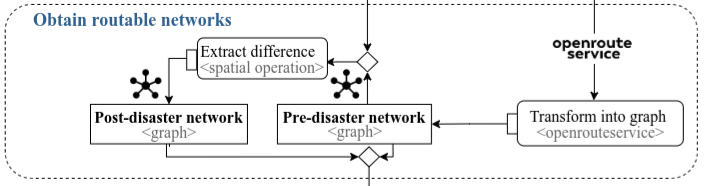

# Obtain routable network

In this section that describes the lane of the workflow "Obtain routable networks", we created the two outputs (a) pre-disaster network and (b) post-disaster network. The main objects used as inputs are the flood extent and the OSM road network from the previous lane Select Area of Interest. 

* We <span class= "font-color">**transform into graph**</span> the road network from OSM using openrouteservice, which finally led to create the pre-disaster network. 
* The flood extent is used to <span class="font-color"> **extract the difference**</span> with the pre-disaster network obtaining the post-disaster network graph. 




The following map compares the road network from OSM and the routable network from ORS. Unlike the OSM road network, the ORS graph includes the variable "toid" and "fromid" among others. These variables are used as source and target to calculate shortest paths using the Dijkstra algorithm. A limitation of this methodology is that the id from OSM and ORS are different and information such as the address is lost during the transformation of the road network into a graph. One alternative to face this limitation is to use geocoding from the centroid of a segment obtaining its address.

```{=html}
<iframe width="780" height="500" src="data/media/ors_osm_network.html" title="Quarto Documentation"></iframe>
```

```{r}
#| eval: false
#| echo: true
#| code-summary: "How to create comparison visualization map"

## Load data
ors_network <- st_read(postgresql_connection, DBI::Id(schema="agile_gis_2025_rs", "ors_raw_network"))
osm_network <- st_read(postgresql_connection, layer="planet_osm_line")
## Create subset using a bounding box
ors_subset <- ors_network |> dplyr::filter(undrctI ==62320) |> st_bbox()
xrange <- ors_subset$xmax - ors_subset$xmin
yrange <- ors_subset$ymax - ors_subset$ymin
## Expand the bounding box
ors_subset[1] <- ors_subset[1] + (1 * xrange) # xmin - left
ors_subset[3] <- ors_subset[3] + (1 * xrange) # xmax - right
ors_subset[2] <- ors_subset[2] - (2 * yrange) # ymin - bottom
ors_subset[4] <- ors_subset[4] + (2 * yrange) # ymax - top
## Convert bounding box into polygon
ors_subset_bbox <- ors_subset %>%  # 
  st_as_sfc() 

ors_subset_bbox_manual <- c(-51.215816,
                                    -30.034622,
                                    -51.206353,
                                    -30.025891) names(ors_subset_bbox_manual) <- c("xmin","ymin","xmax","ymax")
bbox_manual <- st_as_sfc(st_bbox(ors_subset_bbox_manual, crs=4326))
## Use the polygon to subset the network
sf_use_s2(FALSE)
intersection_ors <- sf::st_intersection(ors_network, bbox_manual)
intersection_osm <- sf::st_intersection(st_transform(osm_network,4326), bbox_manual)
## Mapview maps
library(mapview)
library(leafpop)
m1 <- mapview(intersection_osm, 
              color="#6e93ff",
              layer.name ="OpenStreetMap - Geometry",
              popup=leafpop::popupTable(intersection_osm, 
                               zcol=c("osm_id","name","way")))
m2 <- mapview(intersection_ors,
              color ="#d50038",
              layer.name="OpenRouteService -Graph",
              popup=popupTable(intersection_ors))
library(leafsync)
sync(m1,m2) 
```

Once this lane is finished, the pre-processing phase is ove providing the main objects of the study, the flood extent, municipalities, road network and hospitals. We used these objects in the next phase of centrality and accessibility analysis