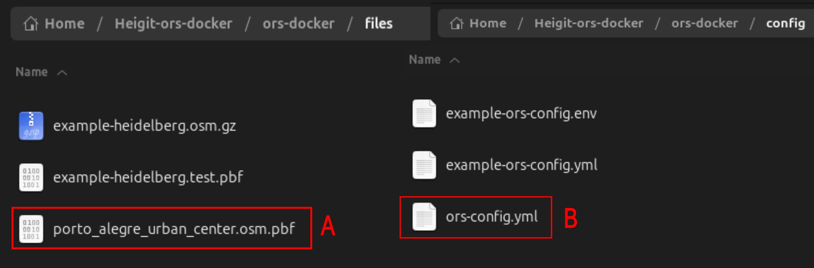
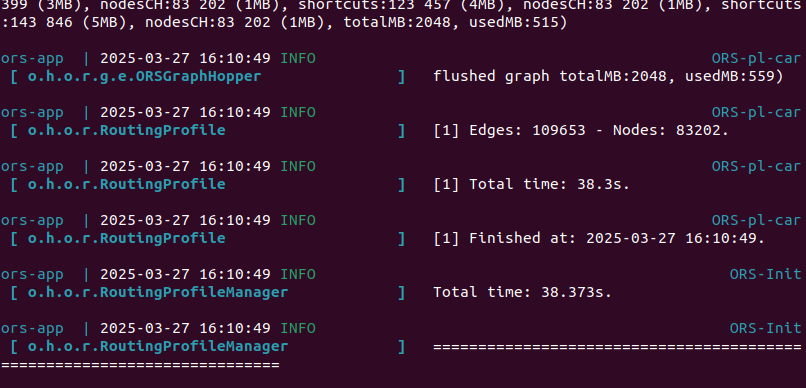

# Transform into graph

```{r}
#| eval: true
#| echo: false
#| include: false
library(sf)
library(DBI)
library(RPostgres)
connection <- DBI::dbConnect(RPostgres::Postgres(),
                             user="docker",
                             password="docker",
                             host="localhost",
                             dbname="gis",
                             port=25432)
municipalities_ghs <- st_read(connection, Id(schema="agile_gis_2025_rs", table="municipalities_ghs"))
ghs_aoi_net_largest <-  st_read(connection, Id(schema="agile_gis_2025_rs", table="ghs_aoi_net_largest"))
table_rq_1_2_net <- st_read(connection, Id(schema="public", table="table_rq_1_2_net"))
ors_raw_network <-  st_read(connection, Id(schema="agile_gis_2025_rs", table="ors_raw_network"))
ors_raw_network_vertices_pgr <-  st_read(connection, Id(schema="agile_gis_2025_rs", table="ors_raw_network_vertices_pgr"))
```


## Run ORS

Having obtained the OpenStreetMap (OSM) road network of the AOI, we run the docker for <span class="font-color">**OpenRouteService (OSM)**</span>  ^[[https://giscience.github.io/openrouteservice/run-instance/running-with-docker](https://giscience.github.io/openrouteservice/run-instance/running-with-docker)],which transforms the OSM geometry into a routable graph. 

Firstly, in the _ors-config.yml_ from OpenRotueService (ORS), the “source file” parameter located in the line 102 is set to find the directory containing the OSM road network (See Fig 1B). In this case, we set the directory to _/home/ors/files/porto_alegre_urban_center.osm.pbf_ (See Fig 1A). Secondly, before running the docker, we added the file "porto_alegre_urban_center.osm.pbf" obtained in the lane obtain routable network to the directory files inside the docker. 




The last step is to run the ORS docker using th following command [ORN-1] `docker compose up` in the terminal where the file _docker-compose.yml_ is located. Do not close this window or run the docker with the parameter -d.

```{bash}
#| eval: false
#| echo: true
#| code-summary:  "[ORN-1] How to run ORS using docker"

 docker compose up
```


OpenRouteService (ORS) created a routable network with costs and adding information for each node such as the origin, “fromId”, and the destination, “toId”. We named _ors_raw_network_ to the table containing this network made up of 109653 edges and 83202 nodes.




```{r}
#| echo: false
#| eval: false

library(sf)
component_analysis_network <- sf::st_read(connection,
                              DBI::Id(
                                schema="agile_gis_2025_rs",
                                "aoi_net_components"))

```

## Export from ORS to R

The R script “get_graph” from Marcel Reinmuth exported the ORS network to R. This script contains the function get_graph() that allowed us to transfer the data from the ORS docker to the R enviroment. The parameters used were no_cores to 4, which depends on your CPU ; aoi and aoi_bbox to select and mask related to the AoI ; profile to 'driving-car'. It is possible to adjust these parameters to the user case. Finally, we exported this R object as _ors_raw_network.shp_.

```{r}
#| eval: false
#| echo: true
#| code-summary: "[ORN-2] Importing ORS network to R"

# Import data from PostgreSQL into R
library(sf)
library(DBI)
sampling_area <-  sf::st_read(postgresql_connection,
                              DBI::Id(
                                schema="agile_gis_2025_rs",
                                "core_metropolitan_area"))
# Load Marcel's script
source('/home/ricardors/agile-gscience-2024-rs-flood/code/paper/get_graph.R')
### Obtaining the bounding box and area of interest
sampling_area_aoi <- sampling_area %>% st_as_sfc()
sampling_area_bbox <- sf::st_bbox(sampling_area)
### Exporting the openrouteservice graph into R
exported_graph <- get_graph(port=8080,
                            aoi_bbox=sampling_area |> sf::st_bbox(),
                            aoi=sampling_area_aoi,
                            profile='driving-car',
                            no_cores=4)
### Storing the data
sf_data <- exported_graph[[1]]
net <- exported_graph[[2]]
### Exporting the data into a shp file
sf_data  %>% sf::st_write("ors_raw_network.shp")

# time: 626039 ms

```

This shapefile can be exported to PostgreSQL|QGIS.  The data in the PostgreSQL database is automatically available in QGIS using the DB Manager plugin^[[QGIS-DB Manger: https://docs.qgis.org/3.40/en/docs/user_manual/plugins/core_plugins/plugins_db_manager.html](https://docs.qgis.org/3.40/en/docs/user_manual/plugins/core_plugins/plugins_db_manager.html)].  since we connected it with each other already. Bear in mind that is required to refresh the connection when new data is imported to the server.

```{bash}
#| eval: false
#| echo: true
#| code-summary: "The tool shp2pgsql imported the data from R into PostgreSQL"

sudo shp2pgsql -D -I -S -s 4326 ors_raw_network ors_raw_network | psql -h localhost -p 25432
```

**troubleshooting 5**  When uploading the shapefile to the PostgreSQL database, the program frozen on occassions. We solved this by using ogr2ogr, R or QGIS instead of shp2pgsql.

# Obtain pre-disaster network

We used pgrouting [[Pgrouting: https://docs.pgrouting.org/latest/en/pgr dijkstra.html](https://docs.pgrouting.org/latest/en/pgr dijkstra.html)] to use the algorith Dijkstra for the centrality and redundancy analysis. The first part of the query [ORN-4] cast the variables toId, fromId and id to bigint as the documentation from pgrouting indicated. The function pgr_createverticestable created the pgrouting routable network generating the auxiliar table _ors_raw_network_vertices_pgr_. 

```{sql}
#| eval: false
#| echo: true
#| code-summary: "[ORN-3] Editing ORS network to be routable for pgrouting"

--- Cast variables
ALTER TABLE ors_raw_network 
	ALTER COLUMN "toId" type bigint,
	ALTER COLUMN "fromId" type bigint,
	ALTER COLUMN "id" type bigint;

--- Creating pgrouting network
EXPLAIN ANALYZE
SELECT pgr_createverticesTable('ors_raw_network',
the_geom:='geom',
source:='fromId',
target:='toId');

--- Execution time: 10580.669 ms
```

The following information shows the first 5 observations from the main table _ors_raw_network_.


```{r}
#| echo: false
#| message: false

library(kableExtra)
library(dplyr)
kbl(slice(ors_raw_network, 1:5))
```

The following table shows the first 5 observations from the auxiliary table _ors_raw_network_vertices_pgr_ created and required by pgrouting to calculate routes.

```{r}
#| echo: false
#| message: false

library(kableExtra)
library(dplyr)
kbl(slice(ors_raw_network_vertices_pgr, 1:5))
```

**troubleshooting 6**: Depending on the method and parameters to import the data, the columns name may be slightly different. For example, ogr_id instead of id or toId instead of toid. To solve this, it is possible to specifically name the geometry column using ogr2ogr with the paremeter `GEOMETRY_NAME=geom`. Alternatively, rename the column once uploaded in the database.

## Select one routable network

We explored the number of components of the raw ORS network using the function pgr_strongComponents()^[[Pgrouting-Components: https://docs.pgrouting.org/dev/en/pgr strongComponents.html](https://docs.pgrouting.org/dev/en/pgr strongComponents.html)]. The reason was that a routable network is considered as one-self connected connected component without disconnected parts or islands [@Lu2018]. We selected the component based on its length from a quantitative point of view and checking its location with a qualitative inspection.

### Components length

We analysed the distribution of the length on each of the networks component. The classification of the components is based on the quantiles as follows:

* <span class="font-color">**Q1:**</span> Components of the network with a length less than the first quartile with a value of 0.027 km. The sum of all these  656 components is 8 km. 
* <span class="font-color">**Q2:**</span> Components of the network with a length between 0.027 km and 0.057 km. When these 632 networks are added, the total length is 27 km.
* <span class="font-color">**Q3:**</span> Components of the network with a length range from  0.057 km to 0.114 km. Adding the length of these 647 components returned a total length of 53 km.
* <span class="font-color">**Q4:**</span> 645 Components with a length between 0.114 km and 10911 km having a total length of 281.2 km.
* <span class="font-color">**Q5:**</span> We named "Q5" to the 1 component with a length higher than 10911 km. The total length is 10912 km.

```{sql}
#| eval: false
#| echo: true
#| code-summary: "[ORN-4] The table aoi_net_componets classified all the components of the network for inspection"

CREATE TABLE aoi_net_components AS 
--- Classify the network by their components
WITH ghs_aoi_net_component AS (
	SELECT 
		*
	FROM
		pgr_strongComponents('SELECT
									id,
									"fromId" AS source,
									"toId" AS target,
									weight AS cost
								FROM
									ors_raw_network')),
--- Calculate the total length of each component
ghs_aoi_net_component_geom AS (
	SELECT
		net.*,
		net_geom.geom
	FROM
		ghs_aoi_net_component AS net
	JOIN
		ors_raw_network AS net_geom
	ON
		net.node = net_geom."fromId"),
	all_component_net AS (
								SELECT
									component,
									st_union(geom) AS the_geom,
									st_length(st_union(geom)::geography)::int AS length --- meters
								FROM
									ghs_aoi_net_component_geom
								GROUP BY component
								ORDER BY length DESC)
SELECT * FROM all_component_net;
---time:  4238.637 ms
```


```{r}
#| echo: true
#| eval: false
#| code-summary: "How to create the bar plot for a quantitative inspection"

library(ggplot2)
# optional
component_analysis_network$quantile <- ecdf(component_analysis_network$length)(component_analysis_network$length)
component_analysis_network$length_km <- component_analysis_network$length/1000 

component_analysis_network$quantile_cat <- 
  cut(component_analysis_network$length_km,
      breaks= c(0,.027,.057,.114,10911,10911918), label=FALSE) 
# quantiles and largest network
## original plot
p1 <- ggplot(component_analysis_network, aes(length_km,
                                             quantile,
                                             color=factor(quantile_cat))) +
      geom_point()

## ggbreak plot without legend
library(ggbreak)
library(patchwork)
library(dplyr)  
df_geom <-na.omit(component_analysis_network) %>%
        group_by(quantile_cat) %>%
        summarise(
            quantile_length= sum(length_km)
        )
df <-  na.omit(component_analysis_network) %>%
        sf::st_drop_geometry() %>%
        group_by(quantile_cat) %>%
        summarise(
            quantile_length= sum(length_km)
        )
library(forcats)
ggplot(df, aes(x=quantile_cat, y=quantile_length), scale=4) +
  geom_col(aes(fill=factor(quantile_cat))) +
  scale_y_continuous(breaks=c(8,27,53)) +
  expand_limits(y=11000) +
  scale_y_break(c(282,10000), scale=2 , ticklabels = c(10000,10912)) +
  scale_y_break(c(52,280), scale=2,ticklabels=c(52,281.2))  +
    labs(
      fill= "Components by quantiles",
    x="Quantiles",
    y="Sum of the network's length (km)",
    caption ="Based on network's components obtained from pgrouting"
  ) +
  scale_fill_manual(values= c("#a6cee3", "#1f78b4", "#b2df8a", "#33a02c", "#fc8d62"),labels=c("Q1 (n=656)",
                              "Q2 (n=632)",
                            "Q3 (n=647)",
                              "Q4 (n=645) ",
                              "Q5 (n=1)")) +
  coord_flip() +
  theme_minimal() +
  theme(legend.position = "bottom")

```

From a quantitative point of view, we selected the 1 component Q5 (orange) because it represented the 96% of the total road network discarding the rest 2580 components that only summed up a 4%.

### Components locations

From a qualitative point of view, we carried out a visual inspection to better understand the high number of components or self-connected networks.

```{=html}
<iframe width="780" height="500" src="data/media/map_graphs_components.html" title="Quarto Documentation"></iframe>
```

```{r}
#| eval: false
#| echo: true
#| code-summary: "How to create a map for qualitative inspection"

### Tidy component to be used as categorical variable
library(forcats)
component_analysis_network$component  <- component_analysis_network$component |> as.character() |> as_factor()
## Visualization
library(mapview)
library(leafpop)
m1_net <- df_geom |>
              dplyr::filter(quantile_cat=="1") |>
              mapview(layer.name = "1st quantile",
                      lwd= 3,
                      color="#66c2a5",
                       popup= popupTable( rename(df_geom[1,],
                                                    Quantile="quantile_cat",
                                                    Total_length_km = "quantile_length"),
                                        zcol=(c("Quantile","Total_length_km"))))

m2_net <- df_geom |>
              dplyr::filter(quantile_cat=="2") |>
              mapview(layer.name = "2nd quantile",
                      lwd= 3,
                      color="#1f78b4",
                       popup= popupTable( rename(df_geom[2,],
                                                    Quantile="quantile_cat",
                                                    Total_length_km = "quantile_length"),
                                        zcol=(c("Quantile","Total_length_km"))))
m3_net <- df_geom |>
              dplyr::filter(quantile_cat=="3") |>
              mapview(layer.name = "3rd quantile",
                      lwd= 3,
                      color="#b2df8a",
                       popup= popupTable( rename(df_geom[3,],
                                                    Quantile="quantile_cat",
                                                    Total_length_km = "quantile_length"),
                                        zcol=(c("Quantile","Total_length_km"))))

m4_net <- df_geom |>
              dplyr::filter(quantile_cat=="4") |>
              mapview(layer.name = "4th quantile",
                      lwd= 3,
                      color="#33a02c",
                       popup= popupTable( rename(df_geom[4,],
                                                    Quantile="quantile_cat",
                                                    Total_length_km = "quantile_length"),
                                        zcol=(c("Quantile","Total_length_km"))))

m5_net <- df_geom |>
              dplyr::filter(quantile_cat=="5") |>
              mapview(layer.name = "5th quantile",
                      lwd= 0.5,
                      color="#fc8d62",
                      popup= popupTable( rename(df_geom[5,],
                                                    Quantile="quantile_cat",
                                                    Total_length_km = "quantile_length"),
                                        zcol=(c("Quantile","Total_length_km"))))

m1_net + m2_net + m3_net+  m4_net+m5_net
```

We observed that the relatively small size of some objects appeared next to OSM objects categorized as "barriers", meaning that they were part of private properties. This is the case for the Villa's Home Resort. This qualitative inspection supported our decision to discard these areas as we did not consider it relatively important for an emergency response for this use case.

## Network for Core Metropolotian centrality

The query [ORN-5] analysed again the totaly of the _ors_raw_network_ but limiting the results to 1 ordered by its length in descending order. Using the field "fromid" and "node" allowed to create the pre-disaster network named as _ghs_aoi_net_largest_, which will be used to calculate the Core Metropolitan conectivity.

```{sql}
#| eval: false
#| echo: true
#| code-summary: "[ORN-5] How to select the component Q5"

CREATE TABLE ghs_aoi_net_largest AS
--- Same as classifying the components in previous step
WITH ghs_aoi_net_component AS (
	SELECT 
		*
	FROM
		pgr_strongComponents('SELECT
									id,
									"fromId" AS source,
									"toId" AS target,
									weight AS cost
								FROM
									ors_raw_network')),
--- Similar as obtaining the length, although in this case the largest component of the network is selected
ghs_aoi_net_component_geom AS (
	SELECT
		net.*,
		net_geom.geom
	FROM
		ghs_aoi_net_component AS net
	JOIN
		ors_raw_network AS net_geom
	ON
		net.node = net_geom."fromId"),
	largest_component_net AS (
								SELECT
									component,
									st_union(geom) AS the_geom,
									st_length(st_union(geom)::geography)::int AS length
								FROM
									ghs_aoi_net_component_geom
								GROUP BY component
								ORDER BY length DESC
								LIMIT 1),
	net_largest_component_network_ghs_aoi AS (
						SELECT
						*
						FROM
							ghs_aoi_net_component,
							largest_component_net
						WHERE
							ghs_aoi_net_component.component = largest_component_net.component)
						SELECT
							net_multi_component.*
						FROM
							ors_raw_network AS net_multi_component,
							net_largest_component_network_ghs_aoi AS net_largest_component
						WHERE 
							net_multi_component."fromId" IN (net_largest_component.node);
							
---time: 6799.939 ms

```

## Network for Intracity connectivity

We created tables in the "public" schema lowering the case of columns. There were several reasons. Firsly to reduce the number of tables in the schema "agile_gis_2025_rs" for better understanding. Secondly, we used the library glue [@glue], so we preferred to lower the case of the fields to parse SQL queries with ease. Similarly, the difficulty of parsing SQL queries is reported for the python module sql_alchemy ^[[https://stackoverflow.com/questions/68638554/change-all-column-names-to-lowercase-postgresql](https://stackoverflow.com/questions/68638554/change-all-column-names-to-lowercase-postgresql)]. We used a query[[https://www.postgresonline.com/article_pfriendly/141.html](https://www.postgresonline.com/article_pfriendly/141.html)] to create the statements to alter the columns' table.

```{sql}
#| eval: false
#| echo: true
#| code-summary: "Creating a copy of the network in public schema"

--- First, copy the tables from the schema agile_gis_2025_rs to public
CREATE TABLE ghs_aoi_net_largest AS
    SELECT 
      * 
    FROM
      agile_gis_2025_rs.ghs_aoi_net_largest;
CREATE TABLE municipalities_ghs AS
    SELECT
      *
    FROM
      agile_gis_2025_rs.municipalities_ghs;

--- Second, alter the tables in teh public schema lowering the case of columns
SELECT  'ALTER TABLE ' || quote_ident(c.table_schema) || '.'
  || quote_ident(c.table_name) || ' RENAME "' || c.column_name || '" TO ' || quote_ident(lower(c.column_name)) || ';' As ddlsql
  FROM information_schema.columns As c
  WHERE c.table_schema NOT IN('agile_gis_2025_rs') 
      AND c.column_name <> lower(c.column_name) 
  ORDER BY c.table_schema, c.table_name, c.column_name;
  
---- After removing extra "", we obtained the queries to alter the required columns:
ALTER TABLE public.ghs_aoi_net_largest RENAME "bdrctId" TO bdrctid;
ALTER TABLE public.ghs_aoi_net_largest RENAME "fromId" TO fromid;
ALTER TABLE public.ghs_aoi_net_largest RENAME "toId" TO toid;
ALTER TABLE public.ghs_aoi_net_largest RENAME "undrctI" TO undrcti;
ALTER TABLE public.ghs_aoi_net_largest_post RENAME "bdrctId" TO bdrctid;
ALTER TABLE public.ghs_aoi_net_largest_post RENAME "fromId" TO fromid;
ALTER TABLE public.ghs_aoi_net_largest_post RENAME "toId" TO toid;
ALTER TABLE public.ghs_aoi_net_largest_post RENAME "undrctI" TO undrcti;
```

The code chunk [ORN-6] created a table for each of the municipalities using a loop. In each iteration it intersected the pre-disaster network named _ghs_aoi_net_largest_ to each municipality, cast the variables for pgrouting, analysed the components and created a routable network for pgrouting . The result were 9 main tables (e.g. net_1) with the road network and 9 pgrouting auxiliary tables (e.g. net_1_vertices_pgr). On this occasion, we specify the names of the fields for pgr_dijkstra(). For example, the field "fromId" obtained using ORS is renamed as "source" for pgrouting.

```{r}
#| eval: false
#| echo: true
#| code-summary: "[ORN-6] How to create a network for each municipality"

library(glue)
library(tictoc)
table_rq_1_2_net <- glue_sql("CREATE TABLE table_rq_1_2_net 
                (id integer,
                fromId integer,
                toid integer,
                weight float,
                undrcti integer,
                bdrctid integer,
                wkb_geometry geometry,
                shapename varchar(250))", .con =connection)
table_end_db <- dbGetQuery(conn=connection,table_rq_1_2_net )

for (idx in 1:length(municipalities_ghs$ogc_fid)) {
  tic(glue("run {idx}/{length(municipalities_ghs$ogc_fid)}")) 
  muncipality_id <- municipalities_ghs$ogc_fid[idx]
  table_name_1 <- glue("net_{idx}")
  table_name_2 <- glue("net_largest_{idx}")

  dbExecute(glue_sql("DROP TABLE IF EXISTS {`table_name_1`}", .con=connection),
            conn=connection)
  
  # Assuming you have an open PostgreSQL connection in con
dbExecute(glue_sql("DROP TABLE IF EXISTS {`table_name_1`}", .con=connection),
          conn=connection)  
  query_1 <- glue_sql("CREATE TABLE {`table_name_1`} AS
SELECT
	net.*,
	nuts.shapename 
FROM 
	(SELECT
		* 
	FROM 
		municipalities_ghs 
	WHERE 
		ogc_fid =  {muncipality_id} ) AS nuts,
	ghs_aoi_net_largest AS net
WHERE
	st_intersects(nuts.wkb_geometry, net.geom)", .con = connection)
  # Send the query
  result_q1 <- dbGetQuery(conn= connection, query_1)
  # Alter the table
 query_2 <- glue_sql("ALTER TABLE {`table_name_1`}
    ALTER COLUMN toid type bigint,
    ALTER COLUMN fromid type bigint,
    ALTER COLUMN id type bigint", .con = connection)
	result_q2 <- dbGetQuery(conn= connection, query_2)
dbExecute(glue_sql("DROP TABLE IF EXISTS {`table_name_2`}", .con=connection),
          conn=connection)  	
	query_3 <- glue_sql("CREATE TABLE {`table_name_2`} AS  ---here table
WITH ghs_aoi_net_component AS (
SELECT 
  * 
FROM 
  pgr_strongComponents('SELECT
                               id AS id,
                               fromid AS source,
                               toid AS target,
                               weight AS cost 
                        FROM 
                              {`table_name_1`}')),
--- Calculate the largest component from the network
ghs_aoi_net_component_geom AS (
SELECT 
    net.*,
    net_geom.geom
FROM 
    ghs_aoi_net_component AS net
JOIN 
    {`table_name_1`}  AS net_geom -----
ON 
    net.node = net_geom.fromid),
largest_component_net as (SELECT 
    component,
    st_union(geom) AS the_geom,
    st_length(st_union(geom)::geography)::int AS length
FROM  
    ghs_aoi_net_component_geom
GROUP BY component
ORDER BY length DESC
LIMIT 1),
--- Using the largest component from the network to filter
largeset_component_network_ghs_aoi AS (
SELECT
    *,
    largest_component_net.component,
    largest_component_net.length
FROM
    ghs_aoi_net_component,
    largest_component_net
WHERE 
    ghs_aoi_net_component.component = largest_component_net.component)
SELECT 
    net_multi_component.*
FROM 
    {`table_name_1`} AS net_multi_component,
    largeset_component_network_ghs_aoi AS net_largest_component
WHERE  
    net_multi_component.fromid IN (net_largest_component.node)", .con = connection)
result_q3 <- dbGetQuery(conn= connection, query_3)	
query_4 <- glue(" 
SELECT pgr_createverticestable('{`table_name_2`}',
								the_geom:='geom',
								source:='fromid',
								target:='toid');", .con = connection )
result_q4 <- dbGetQuery(conn= connection, query_4)

  insert_query <- glue_sql("INSERT INTO table_rq_1_2_net (id, fromid, toid, weight, undrcti, bdrctid, wkb_geometry, shapename)
                            SELECT id, fromid, toid, weight, undrcti, bdrctid, geom, shapename 
                            FROM {`table_name_2`}", .con = connection)
  dbExecute(conn = connection, insert_query)
  
	toc()
}
# time: 15077 ms
```

**troubleshooting 7** When the pgr_dijkstra is not found, we copied the tables to the public schema and run again the code.

```{r}
#| echo: false
#| messag: false

library(kableExtra)
library(dplyr)
kbl(slice(table_rq_1_2_net, 1:5))
```

# Obtain post-disaster network

We repeated the code ORN-6 obtaining the IC connectivity limited to each municipality after the flooding. From the lines 3 to 12, we created a table in the database. Then, the loop located between the lines 14 and 114 created the road network and filtered the largest component. Creating the road network is located between the lines 26 and 41, while filtering the largest road network component is situated from 43 to 100. Lastly, we used the function pgr_createverticestables() to each of these largest road network generating a routable network based on the ORS graph. 

```{r}
#| echo: true
#| eval: false
#| warning: false
#| message: false
#| code-summary: "How to repeat ORN-6 for the post-disaster network for each municipality"

library(glue)
library(tictoc)
table_rq_1_2_net_post <- glue_sql("CREATE TABLE table_rq_1_2_net_post 
                (id integer,
                fromId integer,
                toid integer,
                weight float,
                undrcti integer,
                bdrctid integer,
                wkb_geometry geometry,
                shapename varchar(250))", .con =connection)
table_end_db_post <- dbGetQuery(conn=connection,table_rq_1_2_net_post )

for (idx in 1:length(municipalities_ghs$ogc_fid)) {
  tic(glue("run {idx}/{length(municipalities_ghs$ogc_fid)}")) 
  muncipality_id <- municipalities_ghs$ogc_fid[idx]
  table_name_1 <- glue("net_post_{idx}")
  table_name_2 <- glue("net_largest_post_{idx}")
  
  dbExecute(glue_sql("DROP TABLE IF EXISTS {`table_name_1`}", .con=connection),
            conn=connection)
  
  # Assuming you have an open PostgreSQL connection in con
  dbExecute(glue_sql("DROP TABLE IF EXISTS {`table_name_1`}", .con=connection),
            conn=connection)  
  query_1 <- glue_sql("CREATE TABLE {`table_name_1`} AS
SELECT
    net.*,
    nuts.shapename 
FROM 
    (SELECT
        * 
    FROM 
        municipalities_ghs 
    WHERE 
        ogc_fid =  {muncipality_id} ) AS nuts,
    ghs_aoi_net_largest_post AS net
WHERE
    st_intersects(nuts.wkb_geometry, net.geom)", .con = connection)
  # Send the query
  result_q1 <- dbGetQuery(conn= connection, query_1)
  # Alter the table
  query_2 <- glue_sql("ALTER TABLE {`table_name_1`}
    ALTER COLUMN toid type bigint,
    ALTER COLUMN fromid type bigint,
    ALTER COLUMN id type bigint", .con = connection)
  result_q2 <- dbGetQuery(conn= connection, query_2)
  dbExecute(glue_sql("DROP TABLE IF EXISTS {`table_name_2`}", .con=connection),
            conn=connection)      
  query_3 <- glue_sql("CREATE TABLE {`table_name_2`} AS  ---here table
WITH ghs_aoi_net_component_post AS (
SELECT 
  * 
FROM 
  pgr_strongComponents('SELECT
                               id AS id,
                               fromid AS source,
                               toid AS target,
                               weight AS cost 
                        FROM 
                              {`table_name_1`}')),
--- Calculate the largest component from the network
ghs_aoi_net_component_geom_post AS (
SELECT 
    net.*,
    net_geom.geom
FROM 
    ghs_aoi_net_component_post AS net
JOIN 
    {`table_name_1`}  AS net_geom -----
ON 
    net.node = net_geom.fromid),
largest_component_net_post as (SELECT 
    component,
    st_union(geom) AS the_geom,
    st_length(st_union(geom)::geography)::int AS length
FROM  
    ghs_aoi_net_component_geom_post
GROUP BY component
ORDER BY length DESC
LIMIT 1),
--- Using the largest component from the network to filter
largest_component_network_ghs_aoi_post AS (
SELECT
    *,
    largest_component_net_post.component,
    largest_component_net_post.length
FROM
    ghs_aoi_net_component_post,
    largest_component_net_post
WHERE 
    ghs_aoi_net_component_post.component = largest_component_net_post.component)
SELECT 
    net_multi_component.*
FROM 
    {`table_name_1`} AS net_multi_component,
    largest_component_network_ghs_aoi_post AS net_largest_component
WHERE  
    net_multi_component.fromid IN (net_largest_component.node)", .con = connection)
  result_q3 <- dbGetQuery(conn= connection, query_3)  
  query_4 <- glue(" 
SELECT pgr_createverticestable('{`table_name_2`}',
                                the_geom:='geom',
                                source:='fromid',
                                target:='toid');", .con = connection )
  result_q4 <- dbGetQuery(conn= connection, query_4)
  
  insert_query <- glue_sql("INSERT INTO table_rq_1_2_net_post (id, fromid, toid, weight, undrcti, bdrctid, wkb_geometry, shapename)
                            SELECT id, fromid, toid, weight, undrcti, bdrctid, geom, shapename 
                            FROM {`table_name_2`}", .con = connection)
  dbExecute(conn = connection, insert_query)
  
  toc()
}

```
