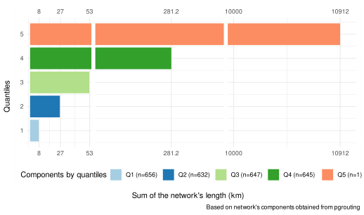

# Transform into graph

Having obtained the OSM road network of the AOI, we run the docker for ORS ^[[https://giscience.github.io/openrouteservice/run-instance/running-with-docker](https://giscience.github.io/openrouteservice/run-instance/running-with-docker)],which transforms the OSM geometry into a routable graph.
In the “ors-config.yml” from
OpenRotueService (ORS), the “source file” parameter is set to find the directory contain-
ing the OSM road network.
OpenRouteService (ORS) created a routable network with
costs and adding information for each node such as the origin, “fromId”, and the destina-
tion, “toId”.
The R script “get graph” from Marcel Reinmuth exported the ORS network
named as “porto alegre net”.
As indicated in the official documentation of pgrouting [[https://docs.pgrouting.org/latest/en/pgr dijkstra.html](https://docs.pgrouting.org/latest/en/pgr dijkstra.html)], we changed the data type of the columns “fromid” and “toid” to execute the function
pgr dijkstra.

<span class= "font-color">**Select Area of Interest (AOI)**</span>

```{r}
#| echo: false
#| eval: false

library(sf)
component_analysis_network <- sf::st_read(postgresql_connection,
                              DBI::Id(
                                schema="agile_gis_2025_rs",
                                "aoi_net_components"))

```

# Visualising OSM and ORS network

```{=html}
<iframe width="780" height="500" src="data/media/ors_osm_network.html" title="Quarto Documentation"></iframe>
```


```{r}
#| eval: false
#| echo: true

## Load data
ors_network <- st_read(postgresql_connection, DBI::Id(schema="agile_gis_2025_rs", "ors_raw_network"))
osm_network <- st_read(postgresql_connection, layer="planet_osm_line")
## Create subset using a bounding box
ors_subset <- ors_network |> dplyr::filter(undrctI ==62320) |> st_bbox()
xrange <- ors_subset$xmax - ors_subset$xmin
yrange <- ors_subset$ymax - ors_subset$ymin
## Expand the bounding box
ors_subset[1] <- ors_subset[1] + (1 * xrange) # xmin - left
ors_subset[3] <- ors_subset[3] + (1 * xrange) # xmax - right
ors_subset[2] <- ors_subset[2] - (2 * yrange) # ymin - bottom
ors_subset[4] <- ors_subset[4] + (2 * yrange) # ymax - top
## Convert bounding box into polygon
ors_subset_bbox <- ors_subset %>%  # 
  st_as_sfc() 

ors_subset_bbox_manual <- c(-51.215816,
                                    -30.034622,
                                    -51.206353,
                                    -30.025891) names(ors_subset_bbox_manual) <- c("xmin","ymin","xmax","ymax")
bbox_manual <- st_as_sfc(st_bbox(ors_subset_bbox_manual, crs=4326))
## Use the polygon to subset the network
sf_use_s2(FALSE)
intersection_ors <- sf::st_intersection(ors_network, bbox_manual)
intersection_osm <- sf::st_intersection(st_transform(osm_network,4326), bbox_manual)
## Mapview maps
library(mapview)
library(leafpop)
m1 <- mapview(intersection_osm, 
              color="#6e93ff",
              layer.name ="OpenStreetMap - Geometry",
              popup=leafpop::popupTable(intersection_osm, 
                               zcol=c("osm_id","name","way")))
m2 <- mapview(intersection_ors,
              color ="#d50038",
              layer.name="OpenRouteService -Graph",
              popup=popupTable(intersection_ors))
library(leafsync)
sync(m1,m2) 
```


# Importing from ORS to R

```{r}
#| eval: false
#| echo: true
#| code-summary: "Importing ORS network to R"
# Connect R with PostgreSQL
library(DBI)
postgresql_connection <- DBI::dbConnect(RPostgres::Postgres(),
                                        user="docker",
                                        password="docker",
                                        host="localhost",
                                        dbname="gis",
                                        port=25432)
# Import data from PostgreSQL into R
library(sf)
sampling_area <-  sf::st_read(postgresql_connection,
                              DBI::Id(
                                schema="agile_gis_2025_rs",
                                "core_metropolitan_area"))
# Load Marcel's script
source('/home/ricardors/agile-gscience-2024-rs-flood/code/paper/get_graph.R')
### Obtaining the bounding box and area of interest
sampling_area_aoi <- sampling_area %>% st_as_sfc()
sampling_area_bbox <- sf::st_bbox(sampling_area)
### Exporting the openrouteservice graph into R
exported_graph <- get_graph(port=8080,
                            aoi_bbox=sampling_area |> sf::st_bbox(),
                            aoi=sampling_area_aoi,
                            profile='driving-car',
                            no_cores=12)
### Storing the data
sf_data <- exported_graph[[1]]
net <- exported_graph[[2]]
### Exporting the data into a shp file
sf_data  %>% sf::st_write("ors_raw_network.shp")
```

# Importing from R to PostgreSQL|QGIS

```{bash}
#| eval: false
#| echo: true
#| code-summary: "The tool shp2phsql imported the data from R into PostgreSQL"

sudo shp2pgsql -D -I -S -s 4326 ors_raw_network ors_raw_network | psql -h localhost -p 25432
# Note: The data in the PostgreSQL is automatically available in QGIS, since we connected it with each other already. Bear in mind that is required to refresh the connection when new data is imported to the server.
```

# Obtaining pre-disaster network

## Creating routable network for pgrouting

```{sql}
#| eval: false
#| echo: true
#| code-summary: "Editing ORS network to be routable for pgrouting"

ALTER TABLE ors_raw_network 
	ALTER COLUMN "toId" type bigint,
	ALTER COLUMN "fromId" type bigint,
	ALTER COLUMN "id" type bigint;


SELECT pgr_createverticesTable('ors_raw_network',
the_geom:='geom',
source:='fromId',
target:='toId');
```


## Analysing components

```{sql}
#| eval: false
#| echo: true
#| code-summary: "The table aoi_net_componets classified all the components of the network for inspection"

CREATE TABLE aoi_net_components AS 
--- Classify the network by their components
WITH ghs_aoi_net_component AS (
	SELECT 
		*
	FROM
		pgr_strongComponents('SELECT
									id,
									"fromId" AS source,
									"toId" AS target,
									weight AS cost
								FROM
									ors_raw_network')),
--- Calculate the total length of each component
ghs_aoi_net_component_geom AS (
	SELECT
		net.*,
		net_geom.geom
	FROM
		ghs_aoi_net_component AS net
	JOIN
		ors_raw_network AS net_geom
	ON
		net.node = net_geom."fromId"),
	all_component_net AS (
								SELECT
									component,
									st_union(geom) AS the_geom,
									st_length(st_union(geom)::geography)::int AS length --- meters
								FROM
									ghs_aoi_net_component_geom
								GROUP BY component
								ORDER BY length DESC)
SELECT * FROM all_component_net;
```



```{r}
#| echo: true
#| eval: false
#| code-summary: "components"


library(ggplot2)
# optional
component_analysis_network$quantile <- ecdf(component_analysis_network$length)(component_analysis_network$length)
component_analysis_network$length_km <- component_analysis_network$length/1000 

component_analysis_network$quantile_cat <- 
  cut(component_analysis_network$length_km,
      breaks= c(0,.027,.057,.114,10911,10911918), label=FALSE) # quantiles and largest network

## original plot
p1 <- ggplot(component_analysis_network, aes(length_km,
                                             quantile,
                                             color=factor(quantile_cat))) +
      geom_point()

## ggbreak plot without legend
library(ggbreak)
library(patchwork)
library(dplyr)  
df_geom <-na.omit(component_analysis_network) %>%
        group_by(quantile_cat) %>%
        summarise(
            quantile_length= sum(length_km)
        )
df <-  na.omit(component_analysis_network) %>%
        sf::st_drop_geometry() %>%
        group_by(quantile_cat) %>%
        summarise(
            quantile_length= sum(length_km)
        )
library(forcats)
ggplot(df, aes(x=quantile_cat, y=quantile_length), scale=4) +
  geom_col(aes(fill=factor(quantile_cat))) +
  scale_y_continuous(breaks=c(8,27,53)) +
  expand_limits(y=11000) +
  scale_y_break(c(282,10000), scale=2 , ticklabels = c(10000,10912)) +
  scale_y_break(c(52,280), scale=2,ticklabels=c(52,281.2))  +
    labs(
      tag="Figure 2",
      fill= "Components by quantiles",
    x="Quantiles",
    y="Sum of the network's length (km)",
    caption ="Based on network's components obtained from pgrouting"
  ) +
  scale_fill_manual(values= c("#a6cee3", "#1f78b4", "#b2df8a", "#33a02c", "#fc8d62"),labels=c("Q5 (n=1)",
                              "Q4 (n=645)",
                            "Q3 (n=647)",
                              "Q2 (n=632) ",
                              "Q1 (n=656)")) +
  coord_flip() +
  theme_minimal() +
  theme(legend.position = "bottom")

```


Map

```{=html}
<iframe width="780" height="500" src="data/media/map_graphs_components.html" title="Quarto Documentation"></iframe>
```


```{r}
#| eval: false
#| echo: true
#| code-summary: "Creating a map for visualization"

### Tidy component to be used as categorical variable
library(forcats)
component_analysis_network$component  <- component_analysis_network$component |> as.character() |> as_factor()
## Visualization
library(mapview)
library(leafpop)
m1_net <- df_geom |>
              dplyr::filter(quantile_cat=="1") |>
              mapview(layer.name = "1st quantile",
                      lwd= 3,
                      color="#66c2a5",
                       popup= popupTable( rename(df_geom[1,],
                                                    Quantile="quantile_cat",
                                                    Total_length_km = "quantile_length"),
                                        zcol=(c("Quantile","Total_length_km"))))

m2_net <- df_geom |>
              dplyr::filter(quantile_cat=="2") |>
              mapview(layer.name = "2nd quantile",
                      lwd= 3,
                      color="#1f78b4",
                       popup= popupTable( rename(df_geom[2,],
                                                    Quantile="quantile_cat",
                                                    Total_length_km = "quantile_length"),
                                        zcol=(c("Quantile","Total_length_km"))))
m3_net <- df_geom |>
              dplyr::filter(quantile_cat=="3") |>
              mapview(layer.name = "3rd quantile",
                      lwd= 3,
                      color="#b2df8a",
                       popup= popupTable( rename(df_geom[3,],
                                                    Quantile="quantile_cat",
                                                    Total_length_km = "quantile_length"),
                                        zcol=(c("Quantile","Total_length_km"))))

m4_net <- df_geom |>
              dplyr::filter(quantile_cat=="4") |>
              mapview(layer.name = "4th quantile",
                      lwd= 3,
                      color="#33a02c",
                       popup= popupTable( rename(df_geom[4,],
                                                    Quantile="quantile_cat",
                                                    Total_length_km = "quantile_length"),
                                        zcol=(c("Quantile","Total_length_km"))))

m5_net <- df_geom |>
              dplyr::filter(quantile_cat=="5") |>
              mapview(layer.name = "5th quantile",
                      lwd= 0.5,
                      color="#fc8d62",
                      popup= popupTable( rename(df_geom[5,],
                                                    Quantile="quantile_cat",
                                                    Total_length_km = "quantile_length"),
                                        zcol=(c("Quantile","Total_length_km"))))

m1_net + m2_net + m3_net+  m4_net+m5_net
```


## Visualising largest component

```{sql}
#| eval: false
#| echo: true
#| code-summary: "The table ghs_aoi_net_largest selected the largest components of the network"

CREATE TABLE ghs_aoi_net_largest AS
--- Same as classifying the components in previous step
WITH ghs_aoi_net_component AS (
	SELECT 
		*
	FROM
		pgr_strongComponents('SELECT
									id,
									"fromId" AS source,
									"toId" AS target,
									weight AS cost
								FROM
									ors_raw_network')),
--- Similar as obtaining the length, although in this case the largest component of the network is selected
ghs_aoi_net_component_geom AS (
	SELECT
		net.*,
		net_geom.geom
	FROM
		ghs_aoi_net_component AS net
	JOIN
		ors_raw_network AS net_geom
	ON
		net.node = net_geom."fromId"),
	largest_component_net AS (
								SELECT
									component,
									st_union(geom) AS the_geom,
									st_length(st_union(geom)::geography)::int AS length
								FROM
									ghs_aoi_net_component_geom
								GROUP BY component
								ORDER BY length DESC
								LIMIT 1),
	net_largest_component_network_ghs_aoi AS (
						SELECT
						*
						FROM
							ghs_aoi_net_component,
							largest_component_net
						WHERE
							ghs_aoi_net_component.component = largest_component_net.component)
						SELECT
							net_multi_component.*
						FROM
							ors_raw_network AS net_multi_component,
							net_largest_component_network_ghs_aoi AS net_largest_component
						WHERE 
							net_multi_component."fromId" IN (net_largest_component.node);

```


